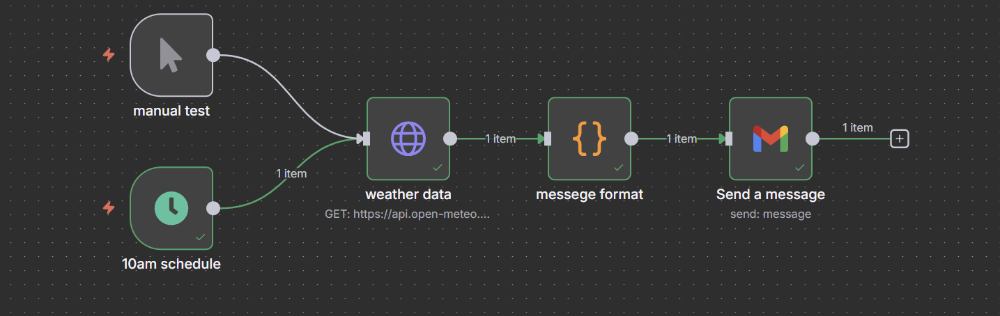

# n8n Weather Report Bot

This is an automated workflow built using [n8n](https://n8n.io/) that sends daily weather updates via email.
 
Features
-⏰ Scheduled to run daily at 10 AM
-🌍 Fetches real-time weather data for Dhaka (or any city)
-📧 Sends formatted weather forecast to your email inbox using Gmail
-🔄 3-day forecast support
-📎 Easy to customize and extend
 
Workflow Nodes
-**Schedule**: Triggers every day at 10 AM
-**HTTP Request**: Calls weather API (Open-Meteo or similar)
-**Function**: Formats the weather message
-**Gmail Node**: Sends the email

Exported Workflow
Download and import `weather-report.json` into your local n8n instance.

Screenshot

How to Use
1.Import this JSON into your local n8n instance
2.Set up your Gmail credentials
3.Customize the city, email, or schedule if needed
